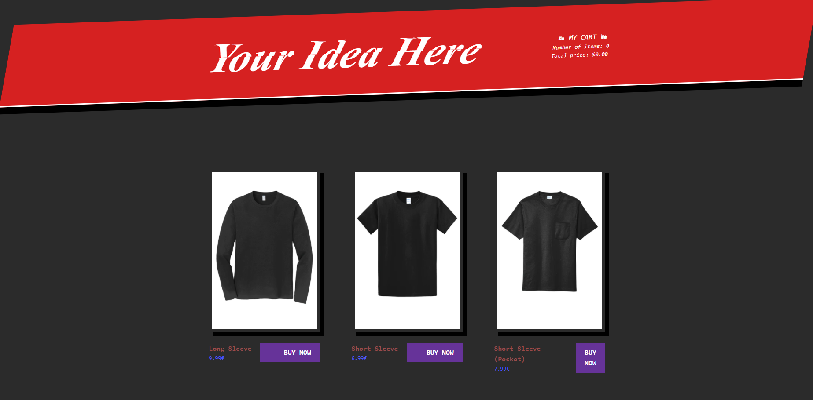

# Your Idea Here Custom T-Shirt store front
A Simple E-commerce webapp powered by [Gatsby](https://www.gatsbyjs.org/), with [Snipcart](https://snipcart.com/) handling merchant processing and [DatoCMS](https://www.datocms.com/) for a headless CMS solution
## About The Project
I've been working for this company for a while and they suggested building an online e-commerce storefront designed to purchase shirts and design them on the spot with shipping and 
 project to get you started with a static ecommerce site powered by [Gatsby](https://www.gatsbyjs.org/), [Snipcart](https://snipcart.com/) and [DatoCMS](https://www.datocms.com/).



## Usage

To run this project locally, install the dependencies of this project:

```
npm install
```

Add an `.env` file containing the read-only API token of your DatoCMS site (set up with the demo button above):

```
echo 'DATO_API_TOKEN=abc123' >> .env
```

Then, to run this website in development mode (with live-reload):

```
npm run develop
```

To build the final, production ready static website:

```
npm run build
```

The final result will be saved in the `public` directory.
